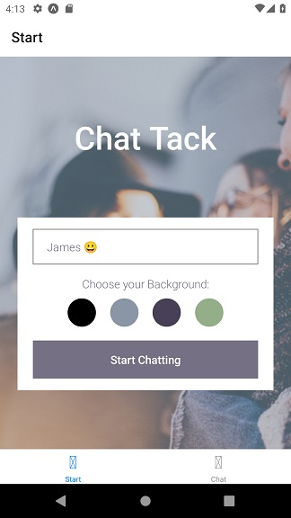
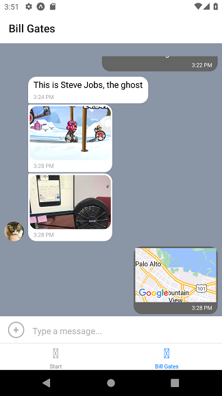

<!-- Markdown syntax here: https://www.markdownguide.org/basic-syntax/ -->
<a id="readme-top"></a>
<br />

<div align="center">
  <a href="https://guyrimel.github.io/Portfolio-Site/index.html">
    
  </a>

  <h3 align="center">Chat Tack</h3>

  <p align="center">
    Chat Tack is a fun, intuitive, and light-weight mobile chat app for both Android and iOS which that allows users to chat, take and share images, and share their location in real time.
  </p>
  <p>
    It is a native and real-time application developed with Expo and React Native. 
    Google firebase is used to authenticate users anonymously and store data in the cloud storage and the local storage.
  </p>
</div>
<br />

<!-- TABLE OF CONTENTS -->

<details>
  <summary>Table of Contents</summary>
  <ol>
    <li>
      <a href="#about-the-project">About The Project</a>
      <ul>
        <li><a href="#key-features">Key Features</a></li>
        <li><a href="#built-with">Built With</a></li>
        <li><a href="#deployments">Deployments</a></li>
        <li><a href="#dev-notes">Dev Notes</a></li>
      </ul>
    </li>
    <li>
      <a href="#getting-started">Getting Started</a>
      <ul>
        <li><a href="#prerequisites">Prerequisites</a></li>
        <li><a href="#installation">Installation</a></li>
        <li><a href="#quick-start">Quick Start</a></li>
        <li><a href="#user-notes">User Notes</a></li>
      </ul>
    </li>
    <li><a href="#license">License</a></li>
  </ol>
</details>

<!-- ABOUT THE PROJECT -->

## About The Project

<!-- SCREENSHOT -->



[Chat Tack Repository](https://github.com/GuyRimel/Chat-Tack)

<!-- KEY FEATURES -->

### Key Features

1. A start screen where a user can enter their name and change their background color.

2. A chat screen displaying the active conversation.

3. Users can send pictures and location data.

4. Data is stored both online and offline.

<!-- BUILT WITH -->

### Built With

- React Native

- Expo

- Google Firestore

- Gifted Chat Library

<p align="right">(<a href="#readme-top">back to top</a>)</p>

<!-- DEPLOYMENTS -->
## Deployments

Chat Tack is not currently deployed. It can be downloaded and installed locally (desktop).

<p align="right">(<a href="#readme-top">back to top</a>)</p>

<!-- DEV NOTES -->

## Dev Notes

- Chat Tack is meant to be installed and run locally. This is why React Native was chosen.

<p align="right">(<a href="#readme-top">back to top</a>)</p>

<!-- GETTING STARTED -->

## Getting Started

<!-- PREREQUISITES -->

### Prerequisites

1. Git installed globally

2. Node Version Manager (NVM) *and* Node.js installed globally

3. Yarn installed globally

4. Expo CLI installed globally

5. An Expo account


<p align="right">(<a href="#readme-top">back to top</a>)</p>

<!-- INSTALLATION -->

### Installation

1. In the terminal, navigate to the desired directory and clone the repo.

```sh
git clone https://github.com/GuyRimel/Chat-Tack.git
```

2. Install Expo CLI globally:

```sh
npm install expo-cli -g
```

3. Log in from the terminal with `expo login`

4. Install Yarn globally:

```sh
npm install yarn -g
```

5. With Yarn installed, install project dependencies:

```sh
yarn
```

<p align="right">(<a href="#readme-top">back to top</a>)</p>

<!-- QUICK START -->

### Quick Start

After installation...

2. Start the application from the terminal:

```sh
yarn start
```

The app will then automatically open in a new browser window.

<p align="right">(<a href="#readme-top">back to top</a>)</p>

<!-- UX NOTES -->

## User Notes

- You will be able to chat with instant messages, images, and even share your current GPS location.

- Any other users of Chat Tack will automatically join the chat room!

<p align="right">(<a href="#readme-top">back to top</a>)</p>

<!-- SCREENSHOTS -->
## Screenshots




<p align="right">(<a href="#readme-top">back to top</a>)</p>

<!-- LICENSE -->
## License

Distributed under the MIT License. See <a href="LICENSE.txt" target="_blank">`LICENSE.txt`</a> for more information.

<p align="right">(<a href="#readme-top">back to top</a>)</p>
